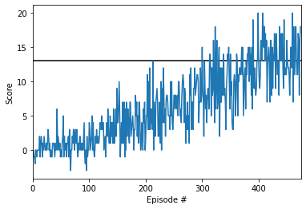

# Deep Reinforcement Learning Nanodegree
# Project 1: Navigation

This repository includes the code to train an execute an intelligent agent able to obtain yellow bananas in a unity environment. 

The agent algorithm is a Double DQN, following the vanilla algorithm presented in the original [DQN paper](https://storage.googleapis.com/deepmind-media/dqn/DQNNaturePaper.pdf) and the improvements suggested in the [Double DQN](https://arxiv.org/abs/1509.06461). My experiments showed that with the Double DQN the agent solves the environment in approximate 50 episodes less!

Most of the algorithm and hyperparameters are the ones used in the lesson Deep-Q Networks. The main differes are:
* The use of the Double DQN improvement
* Error clipping between -1 and 1 (as in the original paper)
* The network is built with 3 hidden linear layers with 128, 64, and 32 units each.

All of this changes are configurable, the double dqn is managed with the variable *DOUBLE_DQN* in the **dqn_agent.py** file. The same for error clipping, managed with the variable *ERROR_CLIPPING*. The number of hidden layers and sizes is controll with the  variable *fc_units*, when calling the function *__init__* of the **model.py** file. 

The agent solved the environment 375 episodes! With the following evolution

### Future work

There's a lot that can be done here!

First of all, I copied most of the hyperparameters from the original lesson. Experimenting with many of them and seing how the agent behaves would be very interesting, specially trying to solve the environment in less episodes.

Then, [Rainbow](https://arxiv.org/abs/1710.02298) showed how to improve a DQN, mixing multiple little improvements. Here I already included the Double DQN, but still missing:
* Prioritized experience replay
* Dueling DQN
* Learning from multi-step bootstrap targets 
* Distributional DQN
* Noisy DQN
